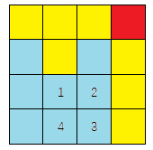

# 第一题：

有一个由小写字母构成的字符串 b 是通过以下方法生成的：

首先，构造一个由小写字母构成的长度不少于 2 的字符串 a。

然后，按照从左到右的顺序，将字符串 a 的所有长度为 2 的子串拼接在一起，构成字符串 b。

例如，如果字符串 a 为 `abac`，那么其所有长度为 2 的子串从左到右依次为 `ab`、`ba`、`ac`，将它们拼接在一起，构成的字符串 b 为 `abbaac`。

现在，给定构造好的字符串 b，请你还原出字符串 a。

可以证明，此问题的答案是唯一的。

#### 输入格式

第一行包含整数 T，表示共有 T组测试数据。

每组数据占一行，包含一个由小写字母构成的字符串 b。

输入保证给定的字符串 b一定是按照题目所述方法生成的。

#### 输出格式

每组数据输出一行结果，一个字符串，表示字符串 a。

#### 数据范围

前 3个测试点满足 1≤T≤10。
所有测试点满足 1≤T≤1000，2≤|b|≤100。

#### 输入样例：

```
4
abbaac
ac
bccddaaf
zzzzzzzzzz
```

#### 输出样例：

```
abac
ac
bcdaf
zzzzzz
```

```c++
#include<string>
#include<iostream>
using namespace std;


/*
input example
4
abbaac
ac
bccddaaf
zzzzzzzzzz
*/
string solve(const string& input) {
	if (input.size() <= 2)
		return input;
	string ans = "";
	for (int i = 0; i < input.size(); i += 2) {
		ans.push_back(input[i]);
	}
	ans.push_back(*(--input.end()));
	return ans;
}

int main() {
	string input_string = "";
	int len_of_the_input = 0;
	cin >> len_of_the_input;
	while (len_of_the_input--) {
		cin >> input_string;
		cout << solve(input_string) << endl;
		input_string.clear();
	}
	return 0;
}

```

# 第二题：

给定一个小于 100 的非负整数 n，请输出其对应的英文写法。

关于数字的具体英文单词不再赘述，需注意的是：当一个数在 [21,99] 范围内时，如果末位不为 0，则用来描述该数的两个单词需要用 `-` 连接，例如 `twenty-one`（21）、`thirty-two`（32）、`ninety-nine`（99）等等。

#### 输入格式

一个整数 n。

#### 输出格式

在一行中输出 n 对应的英文写法。

#### 数据范围

所有测试点满足 0≤n≤99。

#### 输入样例1：

```
6
```

#### 输出样例1：

```
six
```

#### 输入样例2：

```
99
```

#### 输出样例2：

```
ninety-nine
```

#### 输入样例3：

```
20
```

#### 输出样例3：

```
twenty
```

#### 代码：

```C++
#include<map>
#include<iostream>
using namespace std;

/*
input example
6
six
*/

static map<int, string> num_map = {
	{0,"zero"},
	{1,"one"},
	{2,"two"},
	{3,"three"},
	{4,"four"},
	{5,"five"},
	{6,"six"},
	{7,"seven"},
	{8,"eight"},
	{9,"nine"},
	//
	{10,"ten"},
	{11,"eleven"},
	{12,"twelve"},
	{13,"thirteen"},
	{14,"fourteen"},
	{15,"fifteen"},
	{16,"sixteen"},
	{17,"seventeen"},
	{18,"eighteen"},
	{19,"nineteen"},
	{20,"twenty"},
	//
	{30,"thirty"},
	{40,"fourty"},
	{50,"fifty"},
	{60,"sixty"},
	{70,"seventy"},
	{80,"eighty"},
	{90,"ninety"},
	{100,"one hundred"}
};

int gen_map() {
	for (int i = 21; i < 100; ++i) {
		if(i%10 != 0)
			num_map[i] = num_map[i / 10 * 10] + "-" + num_map[i % 10];
	}
	return 0;
}


int main(int argc, char** argv) {
	gen_map();
	for (map<int, string>::iterator it = num_map.begin(); it != num_map.end(); ++it) {
		cout << it->first << " " << it->second << endl;
	}
	return 0;
}
```

# 第三题：

有一个 n×m 的方格矩阵，每个方格都有一种颜色。

颜色最多不超过 26 种，我们将使用不同的大写英文字母来表示不同的颜色。

你的任务是在矩阵中找到一个规模不小于 4 的同色环。

也就是说，请你在矩阵中找到 k 个**不同**的方格，要求它们能够同时满足：

1. k≥4
2. k 个方格的颜色相同。
3. 将这 k 个方格按某种顺序编号为 1∼k 后，能够满足方格 1 与方格 2 相邻、方格 2 与方格 3 相邻、…、方格 k−1 与方格 k 相邻、方格 k 与方格 1 相邻。如果两个方格存在公共边，则称两个方格相邻。

例如，下图中编号的 4 个方格就构成了一个同色环。



请你判断，在给定矩阵中是否存在满足条件的同色环。

#### 输入格式

第一行包含两个整数 n,m。

接下来 n 行，每行包含一个长度为 m 的由大写字母构成的字符串，用来表示矩阵中每个方格的颜色。

#### 输出格式

如果给定矩阵中存在满足条件的同色环，则输出 `Yes`，否则输出 `No`。

#### 数据范围

前 6 个测试点满足 2≤n,m≤10。
所有测试点满足 2≤n,m≤50。

#### 输入样例1：

```
3 4
DDDD
DBCD
DDDD
```

#### 输出样例1：

```
Yes
```

#### 输入样例2：

```
3 4
EEEE
EBCE
EEDE
```

#### 输出样例2：

```
No
```

#### 输入样例3：

```
4 4
AAAB
CACA
CCCA
CCCA
```

#### 输出样例3：

```
Yes
```

#### 输入样例4：

```
7 6
XXXXXY
XYYYXY
XYXXXY
XYXYYY
XYXXXY
XYYYXY
XXXXXY
```

#### 输出样例4：

```
Yes
```

#### 代码：

```C++
#include<iostream>
#include<vector>

using namespace std;
/*
#### 输入格式

第一行包含两个整数 n,m。

接下来 n 行，每行包含一个长度为 m 的由大写字母构成的字符串，用来表示矩阵中每个方格的颜色。

#### 输出格式

如果给定矩阵中存在满足条件的同色环，则输出 `Yes`，否则输出 `No`。

#### 数据范围

前 6 个测试点满足 2≤n,m≤10。
所有测试点满足 2≤n,m≤50。

3 4
DDDD
DBCD
DDDD
*/
// 输入示例
vector<string> graph = {
	"DDDD",
	"DBCD",
	"DDDD"
};
bool ans = false;
char type;
inline bool inArea(int r, int c, int rows, int cols) {
	return r >= 0 && c >= 0 && r < rows && c < cols;
}
void dfs(vector<vector<bool>>& visited, int r, int c, int rows, int cols, char from) {
	// 越界判断
	if (!inArea(r, c, rows, cols)) {
		return;
	}
	// 同色判断
	if (graph[r][c] != type) {
		return;
	}
	// 判断环
	if (visited[r][c]) {
		ans = true;
		return;
	}
	visited[r][c] = true;
	if(from != 'L')
		dfs(visited, r, c-1, rows, cols, 'R');
	if(from != 'R')
		dfs(visited, r, c+1, rows, cols, 'L');
	if(from != 'U')
		dfs(visited, r+1, c, rows, cols, 'D');
	if(from != 'D')
		dfs(visited, r-1, c, rows, cols, 'U');

}

int main() {
	vector<vector<bool>> visited(graph.size(), vector<bool>(graph[0].size(), false));
	for (int i = 0; i < graph.size(); ++i) {
		for (int j = 0; j < graph[0].size(); ++j) {
			if (!visited[i][j]) {
				type = graph[i][j];
				dfs(visited, i, j, graph.size(), graph[0].size(), 'L');
			}
			
			if (ans) {
				cout << "yes" << endl;
				return 0;
			}
			
		}
	}
	cout << "no" << endl;
	return 0;
}

```